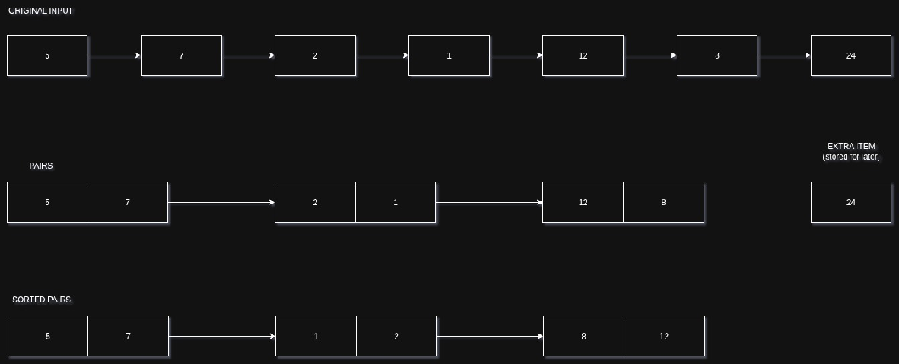
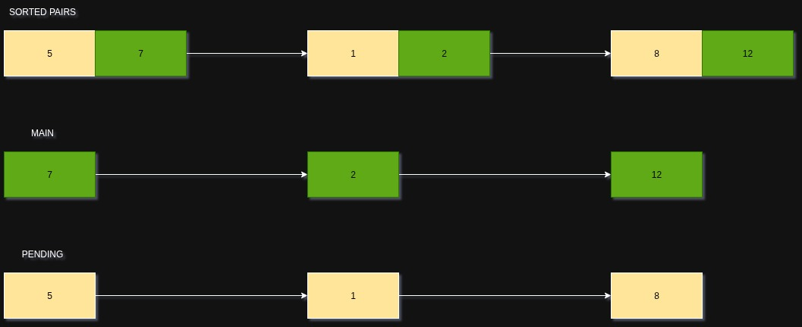
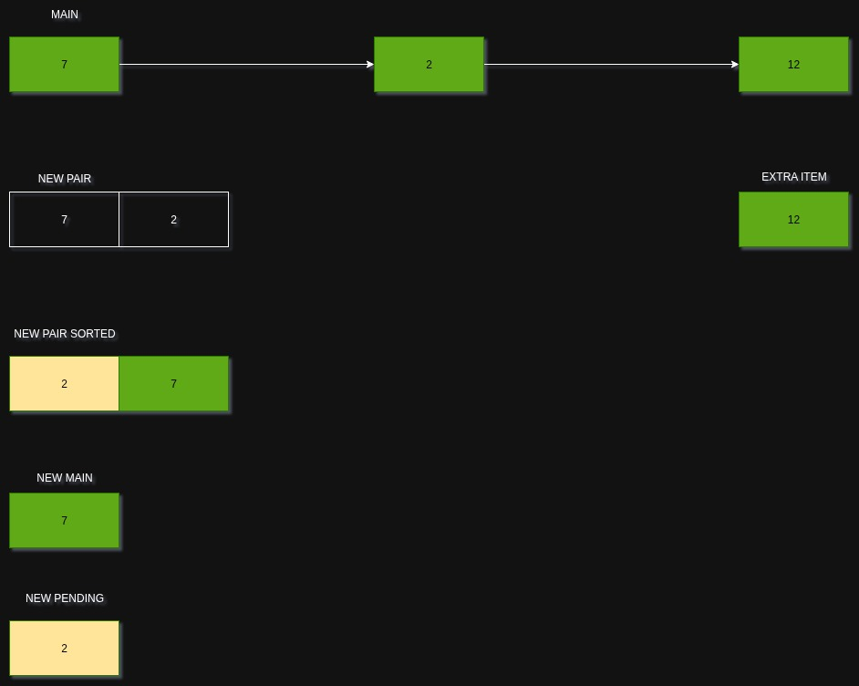
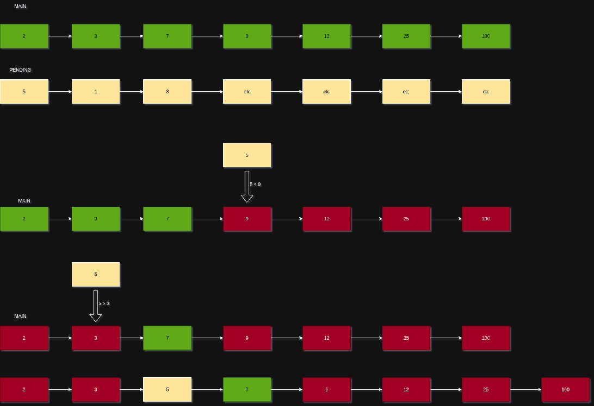
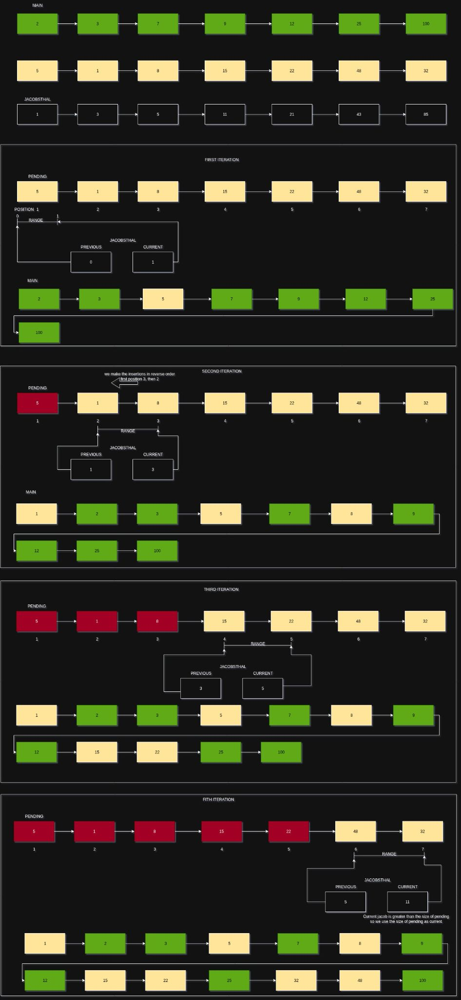

# PmergeMe

Ford-Johnson (Merge-Insertion) sorting implementation in C++98.

This project sorts positive integers using two container strategies:

- `std::list`
- `std::deque`

The goal is to apply the same algorithmic idea to both containers and compare execution time.

## Objective

Implement Merge-Insertion sorting (Ford-Johnson) with:

- strict C++98
- robust input validation
- timing output for both container types
- a correctness check against a reference sorted sequence

## Build

```bash
make
```

Debug mode (verbose error messages):

```bash
make debug
```

Other targets:

```bash
make clean
make fclean
make re
```

## Usage

```bash
./PmergeMe 3 5 9 7 4
```

Input rules:

- only positive integers
- max input size: 3000 numbers

## Program Output

The program prints:

- input sequence (`Before`)
- sorted sequence (`After`)
- processing time for `std::list`
- processing time for `std::deque`

## Project Design

The implementation follows this structure:

- one class for parsing, execution, validation, and printing
- reusable template helpers for shared container operations
- two sorting paths (list/deque) for container-specific behavior

Main files:

- `src/main.cpp`
- `src/PmergeMe.cpp`
- `include/PmergeMe.hpp`
- `include/tools.tpp`

## Merge-Insertion Algorithm (Ford-Johnson)

The process is implemented in six stages.

### 1) Make pairs

Group elements into pairs. If there is an odd element, keep it aside and insert it at the end.



### 2) Split pairs into main and pending

Each pair is sorted internally (small, large).

- `main`: all larger elements (`second`)
- `pending`: all smaller elements (`first`)



### 3) Recursively sort the main sequence

`main` is recursively sorted with the same approach until base cases are reached.



### 4) Binary insertion concept

Pending values are inserted into an already sorted sequence using binary-search insertion.



### 5) Jacobsthal sequence

Jacobsthal indexing is used to reduce comparison count while inserting pending elements.

Reference recurrence used in code:

$$
J_n = J_{n-1} + 2J_{n-2}
$$

In this project, insertion starts from the sequence values used as block boundaries (for example `1, 3, 5, 11, ...`).

### 6) Binary insertion by Jacobsthal blocks

Instead of inserting pending values left-to-right, insertion is done in reverse order inside Jacobsthal-defined blocks.

If a block limit exceeds pending size, it is clamped to the container size. If needed, remaining tail elements are inserted after the main Jacobsthal pass.



## Notes

- `std::deque` allows random access and can reduce insertion-position lookup overhead.
- `std::list` requires iterator traversal for index-like moves, which affects performance characteristics.
- final correctness is validated by comparing against a separately sorted reference sequence.

## References

- Jacobsthal numbers: <https://en.wikipedia.org/wiki/Jacobsthal_number>
- Merge-insertion sort: <https://en.wikipedia.org/wiki/Merge-insertion_sort>
